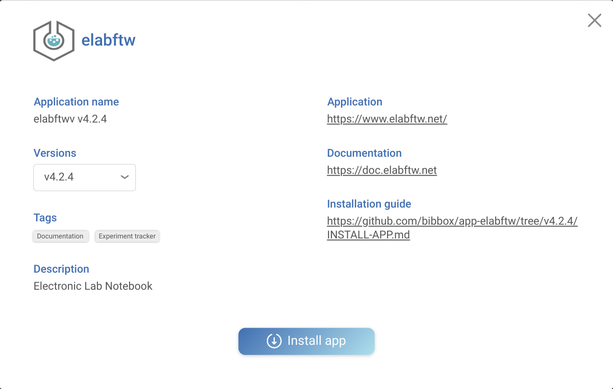
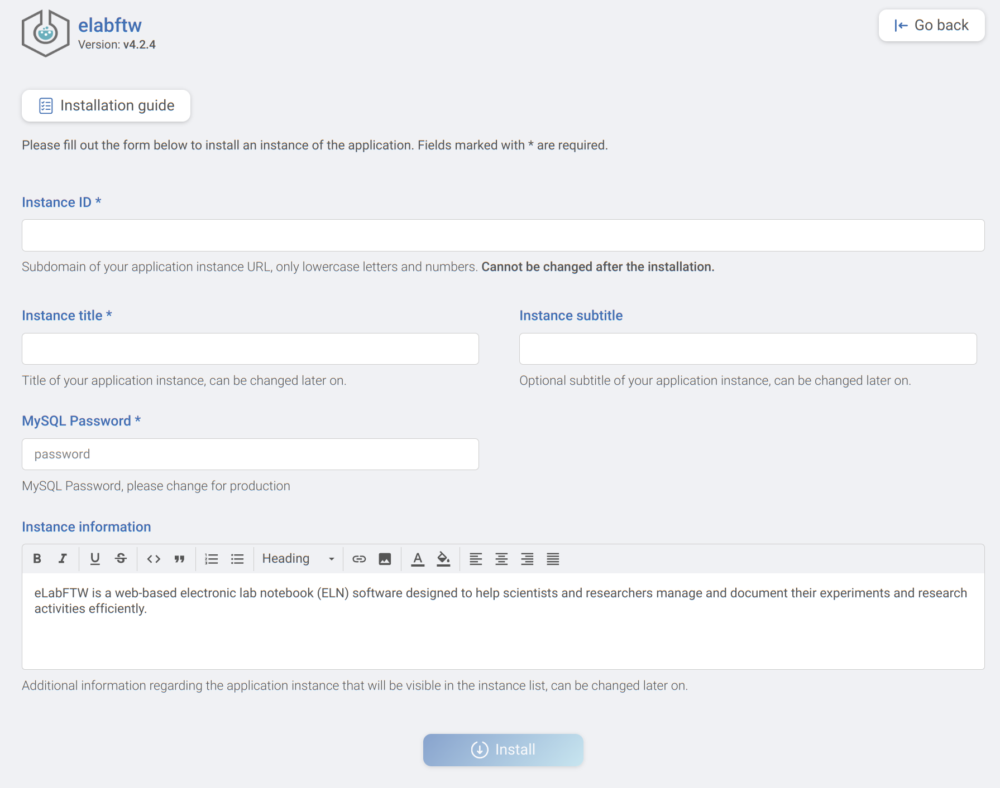

## ElabFTW Installation Instructions 

The application can be installed either within the BIBBOX environment or as a stand-alone solution. Installation instructions can be found within the BIBBOX, followed by setup instructions required once the application has been successfully installed.

## Installation within in the BIBBOX

Once you've selected the desired App for your BIBBOX instance, you can choose from the available versions, as shown in the following figure.

Clicking "Install App" will open a new window, as illustrated in the following figure. Here, you can define the necessary entries. Some fields come pre-filled with suggested options, and if left unchanged, these default values will be used as the entries.

After confirming by clicking "Install," the App will be installed as a BIBBOX instance. Once the installation is complete, you only need to follow a few steps to use the App for the first time, which are described below.

### Some Command Line Work
The installation migth take a while so be patient. The last message in the log should be something like this:

`[services.d] done.`

Once installed we have to do some command line work to initilize elabftw and make it comaptible with HTTP instead of HTTPS. 
Log into our bibbox server (e.g. via ssh) and execute the following commands:

* Import the database structure:
  * `docker exec -it <instance_name>-web bin/install start`
* Disable secrue cookies (Incompatible with HTTP):
  * `docker exec -it <instance_name>-web sed -i 's/session.cookie_secure = true/session.cookie_secure = false/' ../etc/php8/php.ini`
* Set the app url in database (including the http://):
  * `docker exec -it <instance_name>-mysql mysql -u elabftw --database="elabftw" --password="<password>" --execute='UPDATE config SET conf_value = "http://<instance_url>:80" WHERE conf_name = "url";'`

### Restart ElabFTW

Restart the app via the restart button in the BIBBOX dashboard:

### Start ElabFTW

You will get to the login sceen:

#### Register

The first user you register will automatically be the admin user:

#### Make all further configuration steps within the ELabFTW app.

Now you can login with your new admin account.
Further information can be found here https://www.elabftw.net/ and https://doc.elabftw.net/.

## After the installation
Have a nice ride with the Admins youngtimer.

